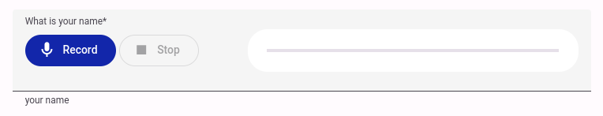
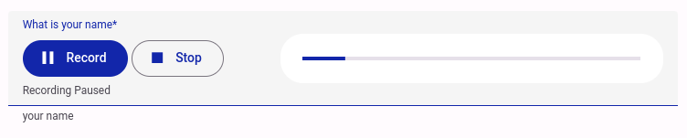
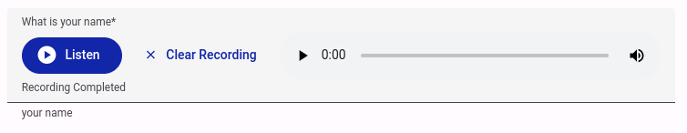
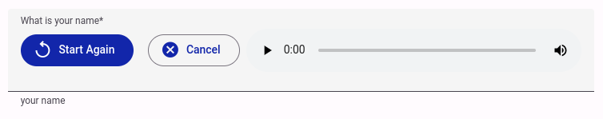
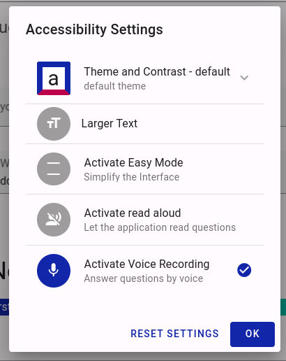
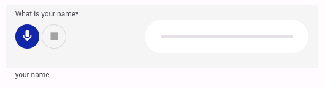
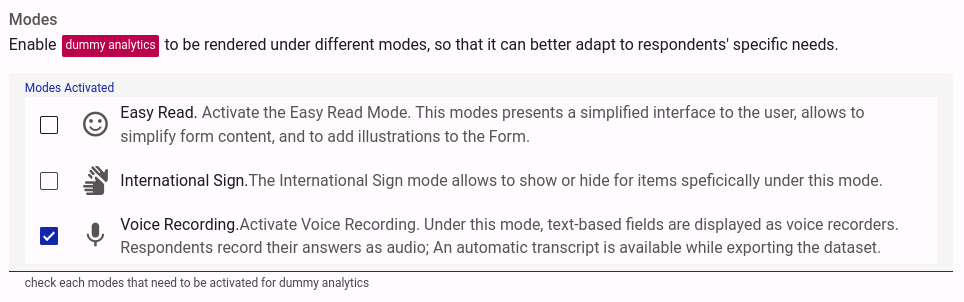
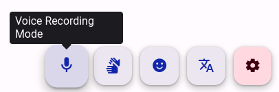
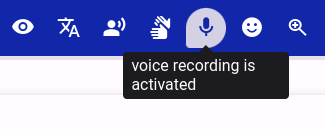
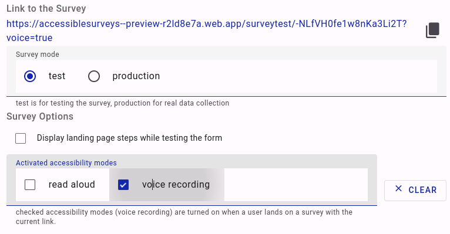

# New Voice Recording Feature - Release Notes

**Date:** 07/08/2023

**Version:** 1.0-pre.2

**Status:** Very Early Preview - Not complete

Accessible Survey launches a new feature that allows to record voice answer. It is an implementation of the [User Story - new voice recording feature](https://docs.google.com/document/d/1vtWBsTzE0xNsQnA7m9O2Di0m-ThG-cV7XX-1uf86dNc)

This Release Notes follows the structure of the [User Story - new voice recording feature](https://docs.google.com/document/d/1vtWBsTzE0xNsQnA7m9O2Di0m-ThG-cV7XX-1uf86dNc) and describes the implementation first from a respondent perspective and then from a form editor and a survey editor perspective.

This feature introduces a new type of accessibility mode (`voice`) which can be `on` (activated) or `off` (default). 

## Respondent perspective

When the `voice` mode is activated for a form, all text-based fields are presented as a voice recording tool instead of the standard data entry tool.

> 
>
> Screenshot of the voice recording tool - before recording. 

The first time a respondent clicks on the `record` button, the browser asks for permission to use the microphone. The respondent needs to accept the permission to use this feature. 

The respondent can record a voice answer by clicking on the `record` button. He/she can pause the recording by clicking on the same button again. 

A slider indicates the recording time. It turns to a warning color when the recording time reaches 80% of the maximum recording time. A warning message is also displayed. 

A recording field has a maximum recording time. When the maximum recording time is reached, the recording is automatically set as completed. 

Only one recording can be active at a time. When a starts while another recording is active, the latter is set as completed.

> 
>
> Screenshot of the voice recording tool - when recording is paused.

The respondent can stop the recording by clicking on the `stop` button and mark the recording as completed. When the recording is completed, the user can listen to the recorded answer by clicking on the `listen` button: 

> 
>
> Screenshot of the voice recording tool - when recording is completed 

This process can be started over if the user can delete the recorded answer by clicking on the `clear recording` button. A confirmation dialog is displayed to make sure the user wants to delete the recorded answer: 

> 
>
> Screenshot of the voice recording tool - asking for confirmation before deleting the recorded answer

A respondent can activate the `voice` mode for a from the accessibility menu. The `Activate Voice Recording` menu item will only be displayed if the form supports the `voice` mode: 

> 
>
> Screenshot of accessibility menu - in a form with the voice recording mode activated

It is also possible to add a switch in a free text in the form that will turn the mode on or off.

### Accessibility

The voice recording tool is accessible with the keyboard. The user can tab through the buttons and activate them with the `Enter` or `Space` key. Focused buttons are highlighted with a distinctive border. They are also announced by assistive technologies like screen readers.

The main button (`Record` if no recording was performed, or `Listen`) is announced as `Record` followed by the question label,  or `Listen` followed by the question label by assistive technologies. 

Each action (e.g. `Recording completed` or `Recording Paused`) is reflected by a helper text below the buttons. Those actions are also announced by assistive technologies.

### Reactive Layout

The voice recording tool is responsive and adapts to the screen size. Buttons are displayed in a row on large screens and in a column on small screens. Some buttons are converted into icon buttons on small screens to save space: 

> 
>
>
> Screenshot of the voice recording tool - on a small screen

## Form editor perspective

The form editor allows to activate the `voice` mode for a form. When the `voice` mode is activated, all text-based fields are presented as a voice recording tool instead of the standard data entry tool.

> 
>
> Screenshot of form editor - activating the voice recording mode

When a form has its `voice` mode activated, a new compose mode is available: `voice`. This compose mode allows to configure the voice recording tool for each individual field, for instance to set max recording time: 

> 
>
> Screenshot of form editor - configuring the voice recording tool

It is also possible rapidly switch the `voice` mode when testing the form and see how it reacts to the change: 

> 
> 
> Screenshot of form editor - testing the voice recording mode

## Survey editor perspective

It is possible to distribute the survey with the `voice` mode pre-activated for survey using form with a `voice` mode: 

> 
>
> Screenshot of survey editor - pre-activating the voice recording mode

## Survey analyst perspective

A link to the voice recording is available in survey exports (both in `csv` and `json` format). The link is stored under the `${answerCode}_audio_url` code and is labelled as `${questionLabel} (audio)`. Clicking on the link will download the audio file, or open it in a new tab if the default browser supports the `audio/webm` format.

Similarly, the automatic transcript is availabled under the `${answerCode}_transcript` code and is labelled as `${questionLabel} (transcript)`.

## Server Process details

When a recording is completed on the client, a temporary `audio/webm` sound file is stored locally. The file is then uploaded to a cloud storage bucket - this is transparent to the respondent. A reference to the bucket location is saved as a survey answer, as well as the download link, so that a survey analyst can download and listen the file.

When the file is uploaded on the bucket, an automatic voice-to-text transcription is triggered. The transcript is then saved on the storage bucket, as well respondent data (under a `_transcript` code postfix).

The transcript language is dependent on the language selected for answering the survey. A `profanity` setting is turned on; this setting filters out potential profanity words from the transcript.

## Localization

The voice recording tool is localized in all languages supported by accessiblesurveys.com. The language is automatically selected based on the language selected for answering the survey.

