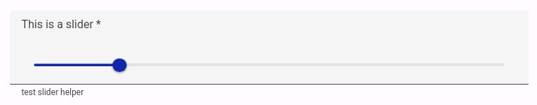
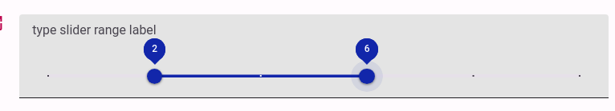
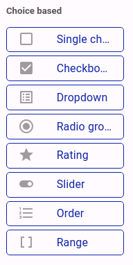
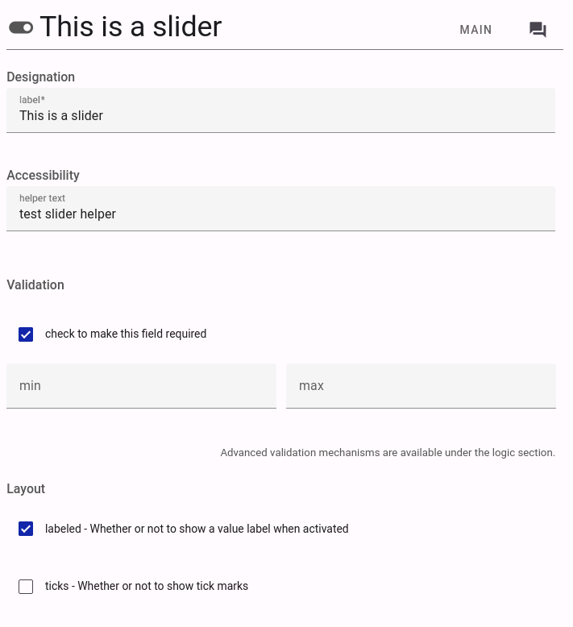

# Slider Component upgrade and New Range Component

**Date:** 21/08/2023

**Version:** 1.0-pre.0

**Status:** Release Candidate

The slider Component has been upgraded to use [Material Design v3 - MD3](https://github.com/material-components/material-web/blob/main/docs/components/slider.md).

The Range Component is a new component that allows the user to select a range of values - it is also based on the same MD3 base component. 

> 
> A Screenshot of the slider component with labeled turned on. 

> 
> A Screenshot of the slider-range component with labeled turned on. 

Range component can now be added to a form by dragging the `Range` element to the form canvas.

> 
> A Screenshot of the slider-range component to drag to the form canvas.

In addition to standards properties like label and helper text, Slider and Range components have the following properties:
- `min` - the minimum value of the slider
- `max` - the maximum value of the slider
- `step` - the step value of the slider
- `labeled` - whether the slider should display the value as a label
- `ticks` - whether the slider should display discrete values as ticks

> 
> A Screenshot of the slider component editor.

